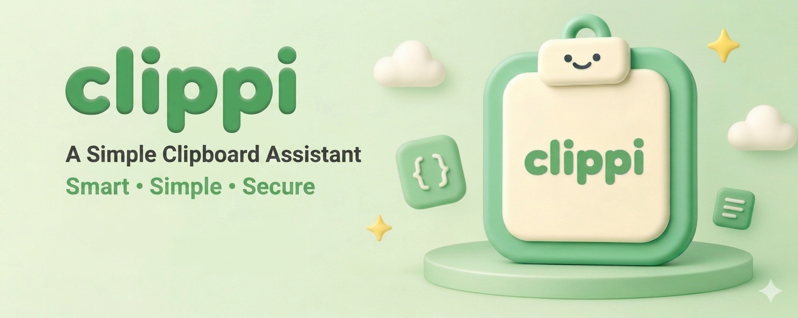

# Clippi - 剪贴板管理器



一个轻量级剪贴板管理器，使用 Rust + Slint 构建。支持 Windows 和 macOS。

## 功能

### 剪贴板监控
- 自动监听系统剪贴板变化，实时记录历史
- 多格式内容检测：纯文本、富文本（HTML）、图片（PNG）、链接
- 内容去重：相同内容重复复制时更新时间戳，不重复记录
- SQLite 本地持久化存储

### 内容管理
- 双击卡片快速粘贴到上一个活动窗口
- 单击复制内容到剪贴板
- 卡片悬浮工具栏：收藏、复制、删除
- 按类型筛选：文本 / 格式 / 图片 / 链接
- 关键词搜索
- 收藏夹筛选
- 自定义排序：按创建时间或最后使用时间

### 窗口与交互
- 全局快捷键呼出/隐藏窗口（默认 Alt+V，可自定义）
- 窗口固定（置顶）模式
- 失焦自动隐藏
- 多显示器支持
- 三种窗口位置模式：居中 / 跟随鼠标 / 记住位置
- 可拖拽边框调整窗口大小

### 设置
- 暗色 / 亮色 / 跟随系统 三种主题
- 开机自启动（Windows 注册表 / macOS LaunchAgent）
- 快捷键录制自定义
- 卡片高度模式：高 / 中 / 低 / 自动
- 数据库路径自定义与迁移

### 系统集成
- 系统托盘常驻后台运行
- 托盘右键菜单：显示窗口、设置、退出
- 双击托盘图标呼出窗口

## 技术栈

| 组件 | 技术 |
|------|------|
| UI 框架 | [Slint](https://slint.dev/) 1.15 |
| 剪贴板 | clipboard-rs |
| 数据存储 | rusqlite (bundled SQLite) |
| 系统托盘 | tray-icon |
| 全局快捷键 | global-hotkey |
| 系统API | windows-sys / objc2-app-kit |

## 构建

```bash
cargo build
cargo run
```

## 平台支持

| 功能 | Windows | macOS | Linux |
|------|---------|-------|-------|
| 剪贴板监控 | ✅ | ✅ | ❌ |
| 粘贴模拟 | ✅ | ✅ | ❌ |
| 全局快捷键 | ✅ | ✅ | ❌ |
| 系统托盘 | ✅ | ✅ | ❌ |
| 开机自启 | ✅ | ✅ | ❌ |
| 焦点监听 | ✅ | ✅ | ❌ |

## 许可

[MIT](LICENSE)
