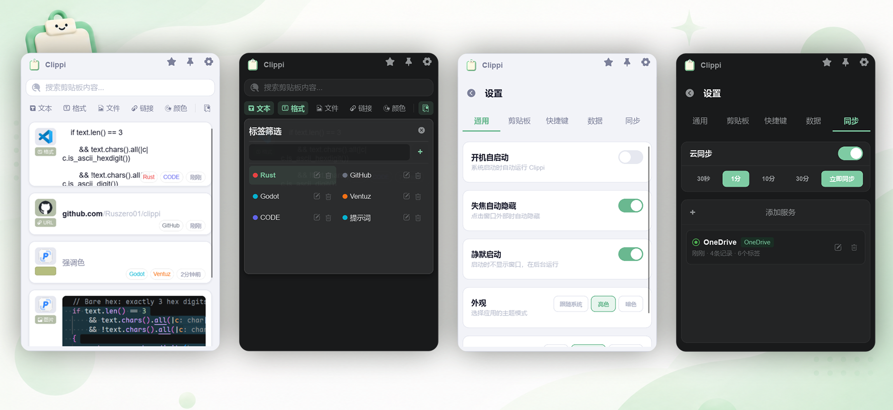

<div align="center">
  <p>
    
  </p>

  # Clippi

  Lightweight Clipboard Manager · Built with Rust + Slint<br>
  Available for Windows and macOS

  <p>
    <a href="README.md">中文</a> · <a href="README_EN.md">English</a>
  </p>

  <p>
    <a href="https://github.com/Ruszero01/clippi/issues">Issues</a> ·
    <a href="https://github.com/Ruszero01/clippi/releases">Changelog</a>
  </p>

  <p>
    <a href="LICENSE"></a>
    
    
    
  </p>
</div>

<p align="center">
  
</p>

---

## Why Clippi?

- Easily record daily clipboard history
- Low system resource consumption
- Cross-platform synchronization across multiple devices
- Sleek and modern user interface

## What Can Clippi Do?

### Clipboard Monitoring
- Multi-format content detection (by priority):
  - **Files** — File/folder paths, multi-file support, system icon extraction; single image files auto-recognized as images
  - **Images** — Automatically process images into thumbnails to save memory.
  - **Links** — URL auto-detection (http/https), domain/path extraction, favicon preview
  - **Colors** — HEX/RGB auto-detection & normalization
  - **Rich Text** — HTML, RTF formats
  - **Plain Text** — Plain text content
  - **Paths** — Windows absolute paths / UNC paths / Unix absolute paths, intelligent recognition
- Content hash deduplication: same content copies update timestamp without creating duplicate entries
- Color normalization dedup: `#FF8000` ≡ `rgb(255,128,0)`, prevents duplicates
- Hotkey blacklist: disable global hotkey in specified applications
- Plain text copy mode: discard rich formatting, keep plain text only
- SQLite (WAL mode) local persistence with customizable database path

### Content Management
- Double-click cards to paste into the last active window
- Right-click context menu (single / batch dual mode):
  - Copy, Paste, Edit, Note
  - Color items: Paste as RGB / Paste as HEX
  - Image items: Open original image
  - Favorite/Unfavorite, Delete
  - Tag management (add/remove/batch operations)
- Multi-select batch operations (Ctrl/Shift select): batch paste (newline-delimited), batch favorite, batch delete, batch tag
- Six-level type filter: Text / Rich Text / Images / Files / Links / Colors
  - Link ⇄ Path, File ⇄ Image bidirectional auto-linkage
- Keyword search — matches text content and tag names simultaneously
- Tag filtering — Switchable AND/OR logic for multiple tags, combined with other filter dimensions via AND
- Sorting: by creation time / by last modified time
- Note inline editing + full content editor

### Tag System
- Create/edit/delete tags, 12 preset colors
- Tag association with clipboard entries (many-to-many)
- Tag filter panel + tag picker panel
- Single-item/batch tag assignment and removal
- Cross-device tag synchronization (with color conflict resolution)

### Window & Interaction
- Global hotkey to show/hide window (default `Alt+V`, supports custom recording)
- Window pin-on-top mode
- Auto-hide on focus loss (configurable)
- Multi-monitor support (cursor's monitor)
- Three popup positions: Centered / Follow mouse / Remember position
- Resize via drag handles (right edge + bottom edge + bottom-right corner)
- Window size persistence across sessions
- Dark / Light / Follow system theme, auto-detect system dark mode
- Toast notifications + settings error scroll alert

### Display Options
- Source app info display (clipboard source app name and icon)
- Card height modes: Tall / Medium / Short / Auto
- Link favicon preview
- File/path type system icons
- Show original content on hover (when notes exist)
- Auto scroll to top (on window show)
- Plain text copy mode

### Cloud Sync
- Multi-backend architecture: support multiple sync services simultaneously
- Local folder backend: sync via OneDrive / iCloud folders
- Auto-detect OneDrive (Windows + macOS) and iCloud (macOS) preset paths
- Cross-device delete & unfavorite propagation (tombstone mechanism, 30-day window)
- Last-writer-wins (LWW) conflict resolution
- Semantic hash comparison, skip unchanged pushes (prevent sync loops)
- Automatic conflict file merging and cleanup
- Configurable sync interval (30s / 1min / 10min / 30min) + manual instant sync
- Favorites-only sync mode

### Settings
- General: Auto-start, auto-hide on focus loss, silent start, theme mode, window position, interface language
- Clipboard: Sort mode, card height, source app, auto-scroll to top, plain-text copy, hover original
- Hotkey: Global hotkey recording, app blacklist management
- Data: Custom database path & migration, max saved items limit
- Sync: Auto-sync toggle, interval, favorites-only mode, multi-backend management (add/delete/edit)

## Tech Stack

| Component | Technology |
|-----------|------------|
| UI Framework | [Slint](https://slint.dev/) 1.16 |
| Clipboard | [clipboard-rs](https://github.com/ChurchTao/clipboard-rs) |
| Storage | [rusqlite](https://github.com/rusqlite/rusqlite) (bundled SQLite, WAL mode) |
| System Tray | [tray-icon](https://github.com/tauri-apps/tray-icon) |
| Global Hotkey | [global-hotkey](https://github.com/tauri-apps/global-hotkey) |
| Image Processing | [image](https://github.com/image-rs/image) |
| HTTP | [ureq](https://github.com/algesten/ureq) (favicon fetching) |
| Configuration | TOML ([serde](https://serde.rs/) + [toml](https://github.com/toml-rs/toml)) |
| Sync Protocol | JSON ([serde_json](https://github.com/serde-rs/json)) |
| Windows | [windows-sys](https://github.com/microsoft/windows-rs) |
| macOS | [objc2](https://github.com/madsmtm/objc2) + [core-graphics](https://github.com/servo/core-foundation-rs) |

## Build

```bash
cargo build
cargo run
```

## Platform Support

| Feature | Windows | macOS |
|---------|---------|-------|
| Clipboard Monitoring | ✅ | ✅ |
| Paste Simulation | ✅ | ✅ |
| Global Hotkey | ✅ | ✅ |
| Hotkey Recording | ✅ | ✅ |
| Hotkey Blacklist | ✅ | ✅ |
| System Tray | ✅ | ✅ |
| Auto-start | ✅ | ✅ |
| Focus Monitoring (Auto-hide) | ✅ | ✅ |
| Source App Detection | ✅ | ✅ |
| File Icon Extraction | ✅ | ✅ |
| Favicon Fetching | ✅ | ✅ |
| Multi-monitor | ✅ | ✅ |
| System Dark Mode Detection | ✅ | ✅ |
| OneDrive Preset Detection | ✅ | ✅ |
| iCloud Preset Detection | ❌ | ✅ |
| Interface Language (zh_CN / en) | ✅ | ✅ |
