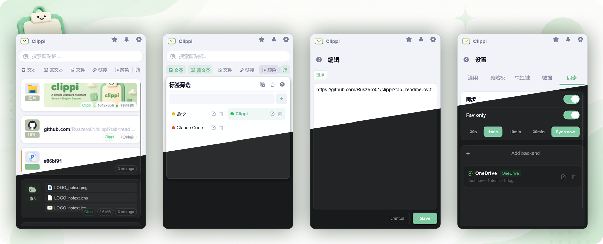
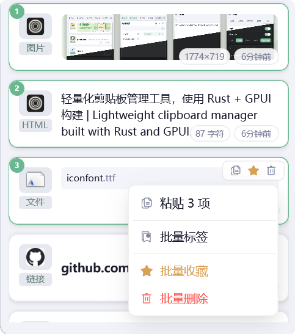
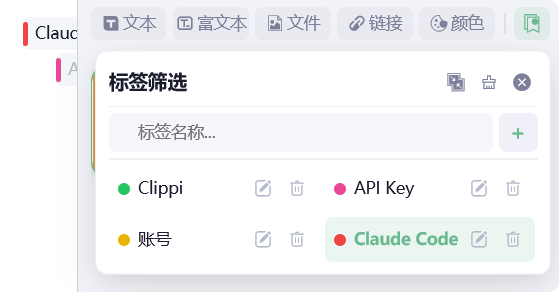
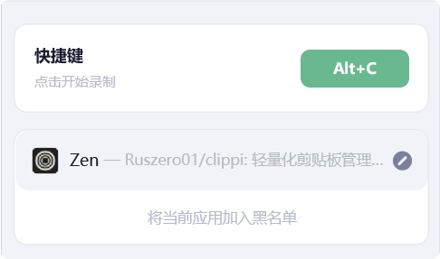
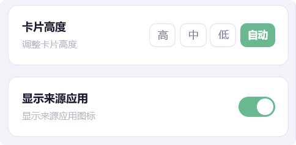
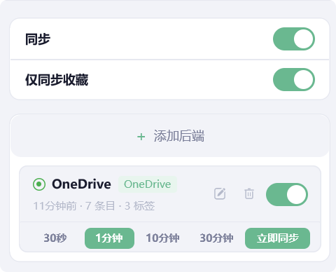

<div align="center">
  <p>
    
  </p>

  # Clippi

  Lightweight Clipboard Manager · Built with Rust + GPUI<br>
  Available for Windows and macOS

  <p>
    <a href="README.md">中文</a> · <a href="README_EN.md">English</a>
  </p>

  <p>
    <a href="https://github.com/Ruszero01/clippi/issues">Issues</a> ·
    <a href="https://github.com/Ruszero01/clippi/releases">Changelog</a>
  </p>

  <p>
    <a href="LICENSE"></a>
    
    
    
  </p>
</div>



---

## Why Clippi?

- GPUI native GPU rendering: No webview process required, combining low resource usage with polished aesthetics.
- Fast Rust backend: Responsive performance with excellent cross-platform capability.
- Multi-backend cloud sync: Supports OneDrive / iCloud / WebDAV with a low-barrier, extensible architecture.

## What Can Clippi Do?

### Clipboard Monitoring


- Multi-format content detection: Plain text, Rich text, Files, Images, Links, Paths, Colors, Phone numbers, Email addresses
- Content hash deduplication: Re-copying the same content updates the timestamp without creating duplicate entries
- Color normalization dedup: `#FF8000` ≡ `rgb(255,128,0)`, prevents duplicates
- Image OCR: Keyword search and paste OCR-extracted text
- QR code detection: Recognizes QR codes with one-click navigation
- Hotkey blacklist: Disable global hotkey in specified applications
- Plain text copy mode: Discard rich formatting and keep plain text only

### Content Management



- Double-click cards for quick paste
- Multi-type entry editing
- Multi-select batch operations: Batch paste (newline-separated), batch favorite, batch delete, batch tag
- Combined type filters: Freely mix multiple filter rules
- Keyword search — matches both text content and tag names
- Tag filtering — Switchable AND/OR logic across multiple tags
- Sorting: By creation time / By last used time
- Sensitive info preview masking: Email shows first 2 chars + domain, phone shows first 3 + last 4 digits

### Tag System



- Create / Edit / Delete tags, 12 preset colors
- Tag association with clipboard entries (many-to-many)
- Side tag bar: Pin filter tags to the left side of window, with expand/collapse animation and pinning
- Tag filter panel + Tag picker panel (both support tag CRUD)
- Single-item / Batch tag assignment and removal
- Cross-device tag synchronization (with color conflict resolution)

### Window & Interaction



- Global hotkey to show/hide (default `Alt+V`, supports custom recording)
- Window pin-on-top mode
- Auto-hide on focus loss
- Multi-monitor support (cursor's monitor)
- Three popup positions: Center / Follow mouse / Remember position
- Dark / Light theme, auto-detect system dark mode

### Display Options



- Source app info display (clipboard source application name and icon)
- Card height modes: Tall / Medium / Short / Auto
- Show original content on hover (when notes exist)
- Plain text copy

### Cloud Sync



- Multi-backend architecture: Supports multiple sync services simultaneously, each with independent toggle and interval
- Local folder backend: Sync via OneDrive / iCloud folders
- WebDAV backend: Supports WebDAV servers, ETag caching + Basic Auth
- Auto-detect OneDrive (Windows + macOS) and iCloud (macOS) preset paths
- Cross-device delete & unfavorite propagation (tombstone mechanism, 30-day window)
- Last-writer-wins (LWW) conflict resolution
- Semantic hash comparison, skip unchanged pushes (prevent sync loops)
- Automatic conflict file merging and cleanup
- Configurable sync interval (30s / 1min / 10min / 30min) + manual instant sync
- Favorites-only sync mode
- Async connection test

## Build

```bash
cargo build
cargo run
```

---

## macOS Users Notice

Clippi is not signed with an Apple Developer certificate (not enrolled in Apple Developer Program). On first launch or after each update, macOS Gatekeeper will block the app from running. Please follow the steps below:

### First Install / After Update

1. After downloading the `.dmg`, drag Clippi into the `Applications` folder
2. Double-click Clippi to open, then select **"Keep"** in the security dialog
3. Go to **System Settings → Privacy & Security**, scroll to the bottom and click **"Open Anyway"** (required once per update)

### Grant Accessibility Permission (Required for Quick Paste)

Clippi's quick paste feature requires Accessibility permission to simulate keystrokes:

1. Open **System Settings → Privacy & Security → Accessibility**
2. Find **Clippi** in the list and enable the toggle
3. If Clippi is not in the list, click the `+` button and add it manually from `/Applications/Clippi.app`

> Without Accessibility permission, quick paste (double-click card / Enter key paste) will not work, but you can still copy and paste manually via the right-click menu.
