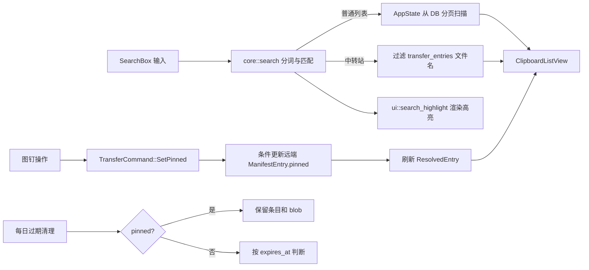

# 中转站固定与搜索优化开发设计

> 状态：待开发
>
> 关联需求：[GitHub Issue #56 — 中转站功能增强建议](https://github.com/Ruszero01/clippi/issues/56)
>
> 适用范围：Clippi 中转站、关键词搜索、筛选栏与根视图导航
>
> 最后更新：2026-08-03

## 1. 背景

Issue #56 最初提出了逐文件设置过期时间、显示过期倒计时、独立上传文件与文件夹等需求。讨论后，项目定位收敛为：中转站继续服务于“剪贴板文件条目的跨设备中转”，不扩展成独立文件同步器。

本次开发只处理以下已确认方向：

1. 为中转站文件增加“固定/取消固定”能力；固定文件不参与自动过期清理。
2. 为中转站增加关键词搜索，搜索规则与普通剪贴板搜索保持一致，但只匹配远端清单的文件名字段。
3. 复用关键词匹配与高亮逻辑，避免普通列表和中转站出现不同的搜索结果或高亮行为。
4. 将搜索框与内容类型/标签筛选栏拆成独立组件；中转站模式只显示搜索框。
5. 修正从设置页进入、退出中转站时的页面跳转，使中转站始终在列表页展示，并在关闭后返回进入前的设置页。
6. 将中转站卡片现有的“几天前”时间标签改成简单的剩余时间标签，明确文件是否永久保留或接近过期。

## 2. 目标与非目标

### 2.1 目标

- 固定状态保存在远端中转站清单中，并在所有设备间一致可见。
- 固定条目使用蓝色左侧竖条标识。
- 悬浮工具栏使用图钉图标 `&#xe633;`，支持固定和取消固定。
- 固定条目永远跳过中转站自动过期清理，但仍可被用户手动删除。
- 中转站搜索直接作用于当前已加载的云端文件清单，不依赖本地 DB 是否存在对应条目。
- 普通列表继续搜索 DB 数据；两种搜索使用相同的分词、大小写、拼音和多关键词规则。
- 搜索结果中的文件名关键词高亮与普通列表一致。
- 中转站模式隐藏没有实际作用的内容类型和标签筛选栏。
- 从设置页打开中转站时跳转到列表页，关闭中转站时返回原设置页。
- 固定项的时间标签显示蓝色“永久”；未固定项显示按天取整的剩余时间，仅剩 1 天时文字标红，标签边框仍使用现有灰色样式。

### 2.2 非目标

- 不增加独立上传按钮、文件夹上传或文件夹浏览。
- 不支持用户为每个文件手动指定过期日期。
- 不显示小时、分钟等精细倒计时，也不按多个剩余天数区间使用不同颜色。
- 不增加“只看固定项”筛选。
- 不支持批量固定/取消固定。
- 固定项本期不自动置顶，列表继续沿用现有远端清单顺序。
- 不改变普通剪贴板“收藏”语义，也不把中转站固定状态写进 `clipboard_items.is_favorite`。

## 3. 现状分析

### 3.1 数据与后端

- `src/core/transfer_types.rs` 中的 `ManifestEntry` 是中转站远端文件元数据，保存在 `clippi_files.json` 或本地文件后端的操作日志中。
- `ManifestEntry` 已包含 `uploaded_at` 和 `expires_at`，但没有固定状态。
- `src/services/transfer_station.rs` 的 `cleanup_expired()` 会拉取清单、筛选过期条目，再通过带冲突重试的 `mutate_manifest()` 删除条目和 blob。
- WebDAV 使用 ETag/条件写入；本地文件后端使用追加式 manifest operation 合并并发修改。
- 中转站列表来自 `AppState.transfer_entries: Vec<ResolvedEntry>`。`ResolvedEntry.is_local` 只表示本地 DB 是否存在对应文件记录，不代表文件是否固定。

### 3.2 搜索

- `SearchBar` 同时负责搜索输入、键盘操作、类型筛选、标签筛选以及两个筛选浮层的开关状态。
- 输入变化调用 `AppState::set_keyword()`，当前实现总会重新加载 DB。
- `AppState::visible_items()` 在中转站模式下直接把全部 `transfer_entries` 转成虚拟 `ClipboardItem`，没有应用关键词。
- 普通列表搜索支持：空白分词、重复词去重、多词 AND、大小写不敏感、中文全拼和拼音首字母匹配。
- `src/ui/search_highlight.rs` 同时包含纯匹配/匹配区间逻辑和 GPUI 渲染逻辑；`src/state/app.rs` 另有一套拼音匹配逻辑，存在重复实现和行为漂移风险。

### 3.3 页面与组件

- `Titlebar` 直接切换 `AppState.transfer_filter_active` 并刷新列表，但它不知道 `RootView.current_view`。
- 因此在设置页点击中转站按钮时，中转站状态已经开启，界面却仍停留在设置页。
- `RootView` 只持有一个 `SearchBar` 实体，无法独立隐藏筛选栏。
- `ClipboardCard` 已为收藏条目绘制左侧竖条；中转站固定状态需要独立语义和蓝色样式，不能借用 `is_favorite`。
- `ClipboardCard` 当前统一根据 `ClipboardItem.updated_at` 显示“几天前”标签；中转站虚拟条目把上传时间写入该字段，尚未展示 `expires_at` 所表达的剩余保留时间。

## 4. 总体方案



核心原则：

- 远端清单是中转站文件元数据和固定状态的唯一事实来源。
- 本地 DB 只继续承担“文件是否已在本机”的解析依据，不持久化固定状态。
- 搜索输入和匹配语义共享，但普通列表与中转站使用不同数据源。
- 搜索中转站时只处理内存中的清单，不在每次按键时访问 WebDAV 或同步文件夹。
- 根视图统一负责页面导航，标题栏只发出用户意图事件。

## 5. 固定文件设计

### 5.1 远端数据模型

在 `ManifestEntry` 增加字段：

```rust
#[serde(default)]
pub pinned: bool,
```

示例清单：

```json
{
  "version": 3,
  "device_name": "DESKTOP-A",
  "updated_at": "2026-08-03T08:00:00Z",
  "files": [
    {
      "hash": "<sha256>",
      "blob_id": "<sha256>-<uuid>",
      "name": "toolkit.zip",
      "ext": "zip",
      "size": 1048576,
      "uploaded_at": "2026-08-01T08:00:00Z",
      "expires_at": "2026-08-08T08:00:00Z",
      "uploaded_by": "DESKTOP-A",
      "pinned": true
    }
  ]
}
```

规则：

- 新上传文件默认 `pinned = false`。
- 固定时保留原 `expires_at`，但清理逻辑无条件跳过该条目。
- 取消固定时重新计算 `expires_at = now + transfer_retention_days`，让文件获得一个完整保留周期，避免历史文件取消固定后被下一次清理立即删除。
- 当 `transfer_retention_days == 0` 时，取消固定后的 `expires_at` 仍为空；此时全局设置本身表示永久保留。
- 手动删除不检查 `pinned`，确认后仍删除清单项和远端 blob。
- 下载、打开本地位置不会改变固定状态。

### 5.2 协议版本与兼容性

将 `TRANSFER_PROTOCOL_VERSION` 从 2 升级到 3。

虽然 `#[serde(default)]` 足以读取旧 JSON，但仍应升级协议版本，原因是旧版本客户端在重写清单时会忽略并丢失 `pinned` 字段。版本升级后，旧客户端会拒绝较新的清单和 operation，从而保护固定状态。

需要明确其用户影响：v2 客户端一旦看到 v3 的 `clippi_files.json` 或 v3 manifest operation，会因“不支持的协议版本”导致整个中转站不可用，连已有文件的列表和下载也无法继续，而不只是不能执行固定。升级期间所有使用同一中转后端的设备必须同步升级到支持 v3 的版本。设置页的中转站说明中应展示“其他设备需升级到支持中转协议 v3 的 Clippi”提示，并为版本不兼容错误提供明确文案，不能只显示通用拉取失败。

迁移要求：

1. `migrate_file_manifest()` 增加 v2 → v3 分支；旧条目自然迁移为 `pinned = false`。
2. 新写入的 WebDAV 清单和本地 manifest operation 使用版本 3。
3. 本地文件后端读取操作日志时必须接受版本 2 和版本 3：
   - v2 operation 反序列化后，缺失的 `pinned` 取 `false`；
   - v3 operation 保留真实固定状态；
   - 高于当前版本的 operation 仍拒绝处理。
4. `validate_manifest_operation()` 的判据明确改为：`version < 2 || version > TRANSFER_PROTOCOL_VERSION` 时拒绝，即当前接受 `2..=3`。不能继续要求 operation version 必须等于当前协议版本，否则升级后已有 v2 操作日志会导致整个中转站无法物化。
5. `ManifestEntry::validate()` 无需为布尔字段增加额外校验，但所有构造器和测试 fixture 都要补齐字段或使用默认值。
6. `write_protocol_marker()` 使用的临时文件名从 `.clippi_files.json.v2.tmp` 同步改为 `.clippi_files.json.v3.tmp`，避免排障时误判实际协议版本。

#### 5.2.1 本地冲突快照合并

`local_folder::merge_manifest_snapshots()` 当前只使用 `uploaded_at` 和 `blob_id` 选择同 hash 条目的优胜版本。加入固定字段后，冲突快照中的同一上传代次需要增加保守合并规则：

1. 仍优先选择较新的 `uploaded_at`。
2. `uploaded_at` 相同时，仍优先选择较大的 `blob_id`，保证新上传代次优先。
3. 只有 `uploaded_at` 和 `blob_id` 都完全相同时，若两个快照的 `pinned` 不同，优先保留 `pinned = true`，避免仅靠冲突基线合并丢失固定保护。
4. operation log 随后仍按现有逻辑时钟顺序应用，是固定/取消固定操作的最终权威；“固定优先”只用于无法判断先后的冲突快照基线，不替代 operation 的顺序语义。

为该规则增加同 hash、同上传代次、不同 pinned 值的冲突快照单元测试。

### 5.3 命令与状态流

扩展命令：

```rust
TransferCommand::SetPinned {
    entry: ManifestEntry,
    pinned: bool,
}
```

对应增加 `TransferAction::SetPinned`，并在 `AppState` 增加：

```rust
pub pending_transfer_pin_updates: HashSet<String>
```

操作流程：

1. 用户点击图钉。
2. `AppState::set_transfer_entry_pinned(hash, pinned)` 从当前 `transfer_entries` 取得完整 entry。
3. hash 已在 `pending_transfer_pin_updates` 时忽略重复点击。
4. 后台线程通过 `mutate_manifest()` 拉取最新清单并定位同时满足 `hash` 与 `blob_key()` 的条目。
5. 修改 `pinned`；取消固定时重置 `expires_at`。
6. 条件写入冲突时沿用现有最多 5 次重试。
7. 成功后重新拉取并解析清单，主线程更新 `transfer_entries` 和列表。
8. 失败或目标已消失时清理 pending 状态并显示警告 toast，不保留错误的乐观状态。

使用 `hash + blob_key()` 而非只用 hash，可防止用户操作的是旧上传代次时误改同内容的新 blob。

### 5.4 自动清理保护

统一修改过期判断：

```rust
fn entry_expired(entry: &ManifestEntry, now: DateTime<Utc>, retention_days: u32) -> bool {
    !entry.pinned
        && effective_expiration(entry, retention_days)
            .is_some_and(|expires| expires <= now)
}
```

`entry_expired()` 不再自行实现 `expires_at` / legacy `uploaded_at` 回退，而是只消费 §5.5 定义的共享 `effective_expiration()`。`cleanup_expired()` 的第一次筛选和 `mutate_manifest()` 内的删除前复检都必须调用同一个 `entry_expired()`。这样固定操作和清理并发时：

- 固定操作先提交：清理重试后看到 `pinned = true`，保留文件。
- 清理先提交：固定操作会发现条目不存在，并向用户提示条目已过期。
- 不允许只在首次快照中过滤固定项，否则清理可能覆盖另一设备刚提交的固定状态。

### 5.5 UI 状态传递

远端固定状态不应复用 `ClipboardItem.is_favorite`，也不应为此扩展本地 DB 字段。沿用当前本地/云端/下载中状态的虚拟标签机制，增加只用于中转站虚拟条目的保留 UID：

```rust
pub const TRANSFER_STATUS_PINNED_UID: &str = "clippi:transfer:pinned";
pub const TRANSFER_STATUS_RETENTION_UID: &str = "clippi:transfer:retention";
```

`AppState::visible_items()` 构造中转站虚拟条目时，在 `ManifestEntry.pinned == true` 的情况下附加 pinned 虚拟标签；同时使用 `self.settings.transfer_retention_days` 调用 `effective_expiration()`，并把得到的有效过期时间放入 retention 元数据标签的 `TagInfo.updated_at`。这里不能误用普通剪贴板历史的 `settings.retention_days`。`ClipboardCard`、`HoverToolbarProps` 和上下文菜单通过 UID 读取固定状态和时间元数据，无需反查全局列表。

虚拟标签使用不重复的负 id：pinned 使用 `-4`，retention 使用 `-5`；现有 `-1` 本地、`-2` 云端、`-3` 下载中保持不变。两个 UID 都必须加入现有 `is_transfer_status` 判定并从底部普通标签列表中排除，不能显示成普通标签 pill。它们只存在于 `visible_items()` 生成的内存对象中，不写入 `tags`、`item_tags` 或 `FileData`，因此远端 manifest 仍是固定状态的唯一事实来源。

新增共享的有效过期时间计算函数，供清理和 UI 投影共同使用：

```rust
pub fn effective_expiration(
    entry: &ManifestEntry,
    retention_days: u32,
) -> Option<DateTime<Utc>>
```

- `retention_days == 0` 时直接返回 `None`（全局“永久”优先：忽略历史设置留下的显式 `expires_at`，避免 UI 倒计时与已停用的清理调度分裂）；
- 否则 `expires_at` 可解析时直接使用；
- 旧条目 `expires_at` 为空时使用 `uploaded_at + retention_days`；
- `pinned` 不改变该函数返回值，是否跳过清理由调用方判断，以便取消固定时仍能基于明确规则重置期限。

这样时间标签和实际清理不会分别实现一套 legacy 回退逻辑。

### 5.6 视觉与交互

- 固定中转站卡片在左侧绘制 3px 蓝色竖条，几何尺寸与收藏竖条一致：`top = 4px`、`bottom = 4px`、圆角 2px。
- 在 `ClippiTheme` 增加语义色 `transfer_pin_color`，默认 `#3B82F6`，避免在卡片和工具栏中重复硬编码。
- 固定条目只显示蓝色竖条；普通收藏条目继续使用现有收藏色，两者互不复用。
- 单条中转站悬浮工具栏增加图钉按钮：
  - 字形：Rust `\u{e633}`，对应需求中的 `&#xe633;`；
  - 未固定 tooltip：“固定文件”；
  - 已固定 tooltip：“取消固定”；
  - 默认颜色使用 `text_2`，悬浮或已固定时使用 `transfer_pin_color`。
- 图钉按钮放在“打开位置/下载”之后、“从中转站删除”之前。
- 右键菜单同步提供“固定文件/取消固定”动作，保证悬浮工具栏不可见或不便使用时仍可操作。
- pending 期间禁止同一 hash 重复入队；本期不额外增加 spinner，成功后的蓝色竖条变化即为完成反馈，失败通过 warning toast 提示。

### 5.7 剩余时间标签

中转站卡片不再使用普通条目的 `format_relative_time(updated_at)` 展示“几天前”，而是在原时间 pill 位置显示生命周期信息。普通剪贴板卡片保持现状。

剩余时间文本由 `ClipboardCard` 在渲染时派生，不在 `visible_items()` 中提前格式化：

1. 按 `TRANSFER_STATUS_RETENTION_UID` 从当前虚拟条目的 `tags` 中找到 retention `TagInfo`。
2. 从 `TagInfo.updated_at` 读取并解析有效过期时间；空字符串表示没有过期时间。
3. 使用渲染时的 `Utc::now()` 计算剩余秒数，再按下表生成文本和文字颜色。
4. `pinned` 标签优先于 retention 时间戳；只要存在 `TRANSFER_STATUS_PINNED_UID`，直接显示蓝色“永久”。

中转站可见时现有每 2 秒轮询会触发列表刷新/重绘，因此跨过 24 小时或到期边界后标签会自动更新。`TagInfo.updated_at` 只承载原始时间戳，语言切换、天数取整和颜色判断始终留在卡片渲染层。

| 条目状态 | 标签文本 | 文字颜色 | 背景与边框 |
| --- | --- | --- | --- |
| `pinned = true` | `永久` / `Forever` | `transfer_pin_color` 蓝色 | 沿用现有 `pill_bg` 与灰色 `pill_border` |
| 未固定、有超过 1 天的剩余时间 | `剩余 N 天` / `Nd left` | 现有 `text_2` | 沿用现有 `pill_bg` 与灰色 `pill_border` |
| 未固定、剩余时间大于 0 且不超过 24 小时 | `剩余 1 天` / `1d left` | `danger` 红色 | 沿用现有 `pill_bg` 与灰色 `pill_border` |
| 未固定、已到期但尚未被清理 | `已到期` / `Expired` | `danger` 红色 | 沿用现有 `pill_bg` 与灰色 `pill_border` |
| 未固定、全局自动过期关闭 | `永久` / `Forever` | 现有 `text_2` 灰色 | 沿用现有 `pill_bg` 与灰色 `pill_border` |

全局自动过期关闭后，历史条目遗留的显式 `expires_at` 一并被忽略（`effective_expiration()` 直接返回 `None`），不会出现卡片倒计时/“已到期”而清理永不执行的分裂状态。

剩余天数使用向上取整，避免出现“剩余 0 天”：例如剩余 25 小时显示“剩余 2 天”，剩余 24 小时以内统一显示红色“剩余 1 天”。本期不显示小时或分钟，也不增加 1–3 天、4–7 天等多段颜色。

固定与全局关闭过期都可能显示“永久”，但只有固定项使用蓝色文字、蓝色左侧竖条和选中态图钉；未固定的全局永久项保持灰色文字，以免混淆固定状态。标签边框在所有状态下都保持现有灰色，不随文字颜色变化。

## 6. 中转站搜索设计

### 6.1 搜索语义

中转站搜索严格只匹配 `ManifestEntry.name`，文件扩展名因为包含在完整文件名中自然可被搜索。

不匹配以下字段：

- 本地路径；
- hash、blob ID；
- 上传设备；
- 上传时间、过期时间；
- 本地/云端/下载中状态；
- 文件大小。

与普通列表保持一致的规则：

1. 输入按 Unicode 空白拆成关键词。
2. 重复关键词去重，并保留首次出现顺序。
3. 多关键词为 AND；文件名必须匹配全部关键词。
4. 英文和普通字符采用大小写不敏感子串匹配。
5. 中文支持原文、全拼和拼音首字母匹配。
6. 空输入显示全部中转站条目。
7. 高亮所有命中的关键词；拼音命中时高亮对应的中文字符范围。

例子：

| 文件名 | 搜索词 | 结果 |
| --- | --- | --- |
| `Railway-Order.pdf` | `rail order` | 命中，两个词均满足 |
| `工作计划.docx` | `gongzuo` | 命中，全拼 |
| `工作计划.docx` | `gzjh` | 命中，拼音首字母 |
| `工作计划.docx` | `工作 xlsx` | 不命中，多词 AND |
| `report.pdf` | `DESKTOP-A` | 不命中，不搜索上传设备 |

### 6.2 数据源分流

搜索框继续只有一份输入和一份关键词状态，但执行路径按当前模式分流：

```text
普通列表：filters.keyword -> reload_items() -> DB 分页读取并匹配完整条目字段
中转站：  filters.keyword -> visible_items() -> 内存过滤 transfer_entries[].entry.name
```

`AppState::set_keyword()` 调整为：

- 始终更新 `filters.keyword` 并清空选择；
- 普通列表模式调用 `reload_items()`；
- 中转站模式不访问 DB，只让调用方用 `visible_items()` 重建当前列表。

关键词过滤逻辑必须位于 `AppState::visible_items()` 的中转站分支内部，而不能只写在 `SearchBox` 的输入回调中。所有列表重建路径——输入变化、进入中转站、下载/删除/固定完成以及每 2 秒 `TransferStateChanged` 轮询刷新——都调用 `visible_items()`，因此过滤放在这里才能保证远端清单刷新后搜索条件不会失效。

退出中转站时需要调用一次 `reload_items()`，使当前搜索词重新作用于 DB。搜索文本在模式切换时保留，因此用户可以用同一关键词在中转站和历史记录之间对照查找。

远端清单仍由进入中转站时的显式刷新和可见期间每 2 秒的现有轮询更新。输入每个字符时不触发网络刷新。

### 6.3 提取共享匹配模块

新增纯逻辑模块 `src/core/search.rs`，从 `filters`、UI 和 `AppState` 中提取：

- 将 `src/core/filters.rs` 现有 `split_keyword_terms()` 移到此模块，保留函数名 `split_keyword_terms(keyword) -> Vec<String>`；
- `text_matches_term(text, term) -> bool`；
- `text_matches_all_terms(text, terms) -> bool`；
- 直接文本、全拼、拼音首字母的匹配区间计算；
- `highlight_segments(text, terms)` 所需的纯数据结构和区间合并。

职责调整：

- `core::search`：唯一的分词、匹配和字符区间事实来源，不依赖 GPUI。
- `core::filters`：删除本地分词实现，直接导入 `core::search::split_keyword_terms`；如需兼容现有调用点，可短期 `pub use` 转发，但不能保留第二份函数体。现有分词测试迁移到 `core::search`。
- `AppState`：定义普通剪贴板条目的“可搜索字段集合”，使用 `core::search` 判断每个词是否在任一字段命中。
- 中转站：仅把 `entry.name` 传给 `text_matches_all_terms()`。
- `ui::search_highlight`：保留预览裁剪和 GPUI 元素渲染，消费 `core::search` 返回的区间/segment，不再自行实现拼音转换。

普通列表允许不同关键词命中条目的不同字段；中转站只有一个名称字段，因此全部关键词都必须在同一名称中命中。

### 6.4 高亮

`ClipboardListView` 已把 `state.filters.keyword_terms()` 传给卡片。中转站虚拟条目的 `full_text` 和文件名均为 `entry.name`，因此拆出共享匹配模块后，现有文件名渲染路径可以直接复用 `render_highlighted_inline()`。

需要确保：

- 搜索筛选与高亮调用相同的 `core::search` 区间算法；
- 不出现“结果被筛出来但没有高亮”或“有高亮但结果不满足全部关键词”的差异；
- 文件名较长时，预览窗口聚焦首个命中位置，沿用现有省略逻辑；
- 清空搜索后不保留旧高亮。

## 7. 搜索框与筛选栏拆分

### 7.1 新组件

把 `src/ui/search_bar.rs` 拆为：

1. `src/ui/search_box.rs`
   - 持有 `InputState`；
   - 订阅输入变化；
   - 调用 `AppState::set_keyword()` 并刷新列表；
   - 保留上下键、Enter、Escape 和现有快捷操作；
   - 暴露 `focus()`、`clear_text()`、`set_theme()`。

2. `src/ui/filter_bar.rs`
   - 持有类型筛选和标签筛选 UI；
   - 持有 `tag_panel_open`、`filter_config_open`；
   - 负责类型筛选按钮、标签按钮和右键打开筛选配置；
   - 暴露关闭浮层和读取浮层状态的方法。

3. `src/ui/mod.rs`
   - 注册两个新模块；
   - 旧 `SearchBar` 不再承担组合职责，完成迁移后删除或改为无状态布局辅助，避免保留两套入口。

拆分时必须同步迁移现有 `Entity<SearchBar>` 依赖：

- `ClipboardListView.search_bar` 和 Ctrl+F 聚焦入口改为 `Option<Entity<SearchBox>>`；
- `TagFilterPanel::new(...)` 当前接收 `SearchBar`，改为只接收它实际需要的 `FilterBar` 或显式关闭回调；
- `TypeFilterConfigPanel::new(...)` 当前接收 `SearchBar`，改为接收 `FilterBar`；
- `RootView` 创建实体和构造上述面板时全部使用新类型，不能留下旧 `SearchBar` 作为隐式桥接层。

### 7.2 根视图布局

`RootView` 分别持有 `search_box` 与 `filter_bar` 实体：

```rust
.when(is_clipboard, |view| {
    view.child(search_box)
        .when(!transfer_active, |view| view.child(filter_bar))
        .child(list_view)
})
```

要求：

- 普通列表的总高度、间距和现有视觉保持不变。
- 中转站只隐藏筛选栏，不隐藏搜索框。
- 进入中转站前主动关闭标签筛选和类型筛选配置浮层，避免隐藏筛选栏后浮层仍残留。
- 普通列表原有类型/收藏/热键/标签筛选状态不清空；关闭中转站后恢复显示并继续生效。
- 根视图中所有原本读取 `SearchBar.tag_panel_open()` 和 `filter_config_open()` 的位置改为读取 `FilterBar`。

## 8. 页面跳转设计

### 8.1 事件归属

`Titlebar` 不再直接修改中转站状态。新增：

```rust
TitlebarEvent::ToggleTransfer
```

点击中转站按钮只发出事件，`RootView` 统一执行导航、浮层关闭、状态切换和列表刷新。

### 8.2 返回页面记录

在 `RootView` 增加：

```rust
transfer_return_view: Option<String>
```

状态机：

| 当前页面 | 当前中转站状态 | 点击结果 |
| --- | --- | --- |
| 列表页 | 关闭 | 开启中转站，停留列表页，return view 为空 |
| 设置页 | 关闭 | 记录 `settings`，切到列表页，再开启中转站 |
| 列表页 | 开启，return=`settings` | 关闭中转站，刷新 DB 列表，再返回设置页 |
| 列表页 | 开启，return 为空 | 关闭中转站，停留列表页 |
| 设置页 | 开启 | 关闭中转站，停留设置页，并清理 return view |

状态机不变量：普通页面切换（列表页 ↔ 设置页，包括 `OpenSettings` 和 `SettingsEvent::Back`）不改变 `transfer_filter_active`，也不改写 `transfer_return_view`；只有用户点击标题栏中转站按钮才执行上述开启/关闭状态机。这样用户在中转站已开启时临时进入设置页再返回，不会意外关闭中转站或丢失最初的返回页面。

编辑页不作为本期可恢复目标：若未来允许从编辑页直接开启中转站，应先完成编辑保存/取消语义设计；当前标题栏行为按现有编辑页限制处理。

进入或退出中转站时统一执行：

1. 关闭标签、类型配置、上下文菜单和标签选择器等列表浮层。
2. 调用 `AppState::toggle_transfer_filter()`。
3. 退出中转站时调用 `reload_items()`，恢复当前 DB 搜索结果。
4. 调用 `list_view.set_items(state.visible_items())`。
5. 通知标题栏和根视图刷新。

## 9. 代码改动清单

| 文件 | 主要改动 |
| --- | --- |
| `src/core/transfer_types.rs` | `ManifestEntry.pinned`、固定/生命周期虚拟标签 UID、有效过期时间计算；校验/fixture 适配 |
| `src/core/migration.rs` | 中转协议升至 v3；v2 → v3 迁移 |
| `src/core/search.rs` | 新增共享分词、拼音匹配与匹配区间算法 |
| `src/core/filters.rs` | 删除重复分词函数体，改用 `core::search::split_keyword_terms` |
| `src/core/mod.rs` | 导出 `search` 模块 |
| `src/services/transfer_station.rs` | `SetPinned` 命令、远端更新、pending 清理、过期保护、取消固定重置期限 |
| `src/services/backends/local_folder.rs` | v2/v3 操作日志兼容；固定字段参与 Upsert、冲突快照合并和物化；临时 marker 文件改为 v3 |
| `src/services/backends/webdav.rs` | 协议 v3 清单读写回归验证，无额外存储结构 |
| `src/state/app.rs` | 固定动作、pending 集合、中转站名称搜索、DB/清单搜索分流、生命周期虚拟标签投影 |
| `src/ui/search_box.rs` | 从旧 SearchBar 提取搜索输入和键盘行为 |
| `src/ui/filter_bar.rs` | 从旧 SearchBar 提取类型/标签筛选及浮层状态 |
| `src/ui/mod.rs` | 注册 `search_box`、`filter_bar`，移除旧组合模块出口 |
| `src/ui/search_highlight.rs` | 改为复用 `core::search`，保留 GPUI 渲染职责 |
| `src/ui/clipboard_card.rs` | 固定状态蓝色竖条、剩余时间 pill、复用文件名高亮 |
| `src/ui/hover_toolbar.rs` | 图钉按钮、固定/取消固定 tooltip 与动作 |
| `src/ui/context_menu.rs` | 中转站固定/取消固定菜单项 |
| `src/ui/clipboard_list.rs` | 处理 `toggle_transfer_pin`、固定状态传递；Ctrl+F 引用改为 `SearchBox` |
| `src/ui/tag_filter.rs` | 构造器和关闭逻辑从 `SearchBar` 迁移到 `FilterBar` |
| `src/ui/type_filter_config.rs` | 构造器引用从 `SearchBar` 迁移到 `FilterBar` |
| `src/ui/titlebar.rs` | 发出 `ToggleTransfer`，不再直接切换状态 |
| `src/ui/root.rs` | 搜索/筛选组件组合、筛选栏显隐、页面返回状态机 |
| `src/ui/theme.rs` | `transfer_pin_color` 语义色 |
| `src/ui/settings/sync.rs` | 增加中转协议 v3 的多设备升级提示/不兼容说明 |
| `src/core/i18n_keys.rs` | 固定、取消固定、操作失败、剩余时间和协议升级提示等中英文文案 |

建议新增/复用的 i18n key：

- `TransferPin`：固定文件 / Pin file；
- `TransferUnpin`：取消固定 / Unpin file；
- `TransferPinFailed`：固定状态更新失败：{0} / Failed to update pin: {0}；
- `TransferRemainingDays`：剩余 {0} 天 / {0}d left；
- `TransferExpired`：已到期 / Expired；
- 复用现有 `TransferKeepForever`：永久 / Forever；
- `TransferProtocolUpgradeRequired`：中转站协议已升级，其他设备也需要升级 Clippi / The transfer protocol was upgraded; update Clippi on other devices；
- `TransferProtocolUnsupported`：当前 Clippi 不支持此中转站协议版本 / This Clippi version does not support the transfer protocol。

`#3B82F6` 目前也用于云端/下载中状态。实现时将颜色值集中为 core 可引用的中转站蓝色常量，并让 `ClippiTheme.transfer_pin_color` 与虚拟状态标签颜色共同来源于该常量，顺便替换 `AppState::visible_items()` 中重复的魔法字符串。

## 10. 推荐实施顺序

1. 增加协议 v3、`pinned` 字段、本地操作日志兼容与冲突快照合并测试。
2. 实现 `SetPinned` 后台命令、冲突重试、取消固定期限重置和清理保护。
3. 提取共享有效过期时间计算，在 `AppState` 接入固定动作、pending 管理、生命周期虚拟标签和剩余时间展示数据。
4. 提取 `core::search`，迁移 `filters::split_keyword_terms`，让普通搜索和现有高亮先通过回归测试。
5. 为 `visible_items()` 增加中转站文件名搜索。
6. 拆分 `SearchBox`/`FilterBar` 并保持普通列表布局不变。
7. 接入卡片蓝条、图钉工具栏、右键菜单和剩余时间 pill。
8. 将中转站切换上移到 `RootView`，完成设置页返回状态机。
9. 补齐 i18n、单元测试和 Windows/macOS 手工验证。

## 11. 测试计划

### 11.1 单元测试

#### 协议与迁移

- v2 清单缺少 `pinned` 时迁移为 `false`。
- v3 清单往返序列化保留 `pinned = true`。
- 新客户端能同时物化 v2 和 v3 的本地 manifest operations。
- `validate_manifest_operation()` 接受版本 2、3，拒绝小于 2 和大于 3 的边界值。
- 高于 v3 的清单和 operation 被安全拒绝。
- WebDAV 条件写入冲突后重试不会丢失另一设备的固定状态。
- 本地冲突快照中同 hash、同 `uploaded_at`、同 `blob_id` 而 pinned 不同时，基线保守保留 `pinned = true`；后续 operation 仍能按逻辑时钟执行取消固定。

#### 固定与清理

- 新上传条目默认未固定。
- 固定命令只更新 hash 和 blob generation 都匹配的条目。
- 固定条目即使 `expires_at` 已经过期也不会被清理。
- 未固定过期条目继续被删除。
- 取消固定按当前保留天数重置 `expires_at`。
- 全局保留天数为 0 时取消固定仍保持空过期时间。
- 清理在 manifest mutation 内复检固定状态。
- 固定条目仍可手动删除。
- 同一 hash 的重复固定请求只入队一次；成功和失败都会清理 pending。
- 有效过期时间对显式 `expires_at`、legacy 回退及 retention=0 三种情况计算正确。
- 固定项时间标签为蓝色“永久”。
- 未固定项剩余时间按天向上取整，24 小时以内为红色“剩余 1 天”，到期后为红色“已到期”。
- 全局过期关闭但未固定的条目显示灰色“永久”，不会误显示蓝色固定态。
- 所有生命周期标签继续使用灰色边框。

#### 搜索

- 空关键词返回全部中转站文件。
- 文件名大小写不敏感匹配。
- 多关键词必须全部匹配。
- 中文原文、全拼、拼音首字母均匹配。
- 只存在于路径、上传设备或状态字段中的词不匹配。
- 中转站搜索不调用 DB reload。
- 每 2 秒轮询刷新或 `TransferStateChanged` 重建列表后，当前关键词过滤仍然生效。
- 退出中转站后，保留的关键词会重新作用于 DB。
- 筛选结果与高亮区间使用同一匹配逻辑。

#### 导航

- 设置页开启中转站后进入列表页。
- 从设置页进入后关闭中转站会返回设置页。
- 从列表页进入后关闭仍停留列表页。
- 进入中转站会关闭筛选浮层。
- 关闭中转站后原类型/标签筛选仍保留。
- 中转站开启时执行普通列表/设置页往返，不改变中转站状态和 `transfer_return_view`。

### 11.2 手工测试

以用户当前运行的 Clippi 实例为准，不由开发流程擅自启动或停止应用。

1. Windows 11 上使用本地文件夹后端，固定文件后等待/手动触发到期清理，确认文件和清单项仍存在。
2. Windows 11 上取消固定，检查到期时间已从取消时刻重新计算。
3. 两台设备分别固定、取消固定，确认状态经清单同步一致；开发阶段可先在单机使用两个独立 Clippi 配置/数据目录指向同一测试后端，形成可重复的双客户端路径。
4. 使用 WebDAV 后端制造并发更新，确认不会覆盖其他条目或恢复已删除条目。
5. 在中转站搜索英文、中文、全拼、首字母和多关键词，检查结果与黄色/主题高亮位置一致。
6. 检查固定卡片左侧蓝条和 `&#xe633;` 图钉在亮色、暗色主题下均清晰。
7. 检查固定项显示蓝色“永久”，普通未固定项显示灰色剩余天数，只剩 1 天和已到期时仅文字变红、边框仍为灰色。
8. 在普通列表和中转站间切换，检查搜索词保留、筛选栏显隐和列表高度无跳动异常。
9. 从设置页进入中转站再关闭，确认返回原设置页及原设置 tab。
10. 在中转站自动刷新、下载、删除和固定同时发生时检查 pending 状态与工具栏动作。
11. 用 v2 客户端或 v2 fixture 访问已写入 v3 状态的后端，确认得到明确升级提示，而不是静默丢字段或通用失败。

### 11.3 工程验证

实现完成后执行：

```powershell
cargo fmt --all -- --check
cargo test
cargo clippy --all-targets --all-features -- -D warnings
```

若需要实际运行应用进行 UI 验证，应先通知用户，并以用户已经运行的实例为准。

## 12. 验收标准

- [ ] 任意中转站单文件可通过悬浮工具栏 `&#xe633;` 图钉固定或取消固定。
- [ ] 固定状态同步到远端清单，并可被其他设备正确读取。
- [ ] 固定条目显示蓝色左侧竖条，未固定条目不显示。
- [ ] 自动到期清理永不删除固定条目；手动删除仍可用。
- [ ] 取消固定不会导致条目因旧过期时间立即消失。
- [ ] 中转站卡片不再显示“几天前”：固定项显示蓝色“永久”，未固定项显示剩余天数，仅剩 1 天或已到期时文字为红色。
- [ ] 生命周期标签始终沿用现有灰色边框；全局关闭过期但未固定的条目以灰色“永久”区别于固定态。
- [ ] 中转站搜索只匹配文件名，并支持与普通搜索一致的多词、大小写和拼音规则。
- [ ] 中转站文件名正确显示关键词高亮。
- [ ] 轮询刷新、下载、删除或固定完成导致列表重建后，当前中转站关键词过滤仍然生效。
- [ ] 搜索中转站不会在每次输入时访问网络或查询 DB。
- [ ] 普通列表继续使用 DB 数据源，现有搜索字段与结果不回退。
- [ ] 中转站模式只显示搜索框，不显示类型和标签筛选栏。
- [ ] 返回普通列表后筛选栏和原筛选状态恢复。
- [ ] 从设置页进入中转站会跳到列表页，关闭后返回原设置页和原 tab。
- [ ] v2 远端清单及本地操作日志可平滑升级，旧数据不丢失。
- [ ] v2 客户端访问 v3 中转站时得到明确的整站不可用和升级提示；所有共享该后端的设备升级后恢复正常。
- [ ] `cargo test` 和严格 Clippy 检查通过。

## 13. 风险与处理

| 风险 | 处理方式 |
| --- | --- |
| 旧客户端重写清单导致固定字段丢失 | 升级协议到 v3，让旧客户端拒绝写入新清单 |
| v2 客户端看到 v3 清单或 operation 后整个中转站不可用 | 在设置页和版本错误中明确提示共享后端的所有设备必须升级；不能表述成只有固定功能不可用 |
| 升级后无法读取已有本地 v2 operation | 放宽 operation 校验并对 v2 做默认字段迁移 |
| 本地冲突快照合并丢失 pinned | 同上传代次且无法判断顺序时保守选择 pinned=true，再由 operation log 提供最终顺序 |
| 清理与固定并发导致误删 | 在条件写入 mutation 内再次调用包含 pinned 判断的统一过期函数 |
| UI 剩余时间与清理实际期限不一致 | 清理和虚拟标签投影共用 `effective_expiration()`，覆盖显式期限和 legacy 回退 |
| 搜索和高亮拼音算法不一致 | 把纯匹配与区间计算提取到 `core::search` 作为唯一实现 |
| 分词在 filters 与 search 中形成两套实现 | 移动现有 `split_keyword_terms`，filters 仅导入或转发，不保留函数体 |
| 每次输入触发 WebDAV 请求 | 搜索只过滤内存 `transfer_entries`，网络刷新维持现有节奏 |
| 轮询刷新冲掉中转站搜索 | 把关键词过滤逻辑固定放在 `visible_items()` 内，所有列表重建入口统一经过该函数 |
| 取消固定后立即过期 | 从取消固定时刻重置完整保留期 |
| 把固定误当成本地收藏 | 固定只存在远端 manifest，DB `is_favorite` 保持不变 |
| 设置页与中转站状态错位 | 标题栏只发事件，由 RootView 统一管理页面和返回状态 |

## 14. 后续可选增强

以下内容不纳入本期，但数据结构可自然支持：

- 只显示固定项；
- 固定项排序优先；
- 批量固定/取消固定；
- 固定状态的操作时间和跨设备显式冲突策略；
- 在设置页展示固定文件占用空间。

这些增强应在本期协议 v3 和单条固定交互稳定后另行评估。
